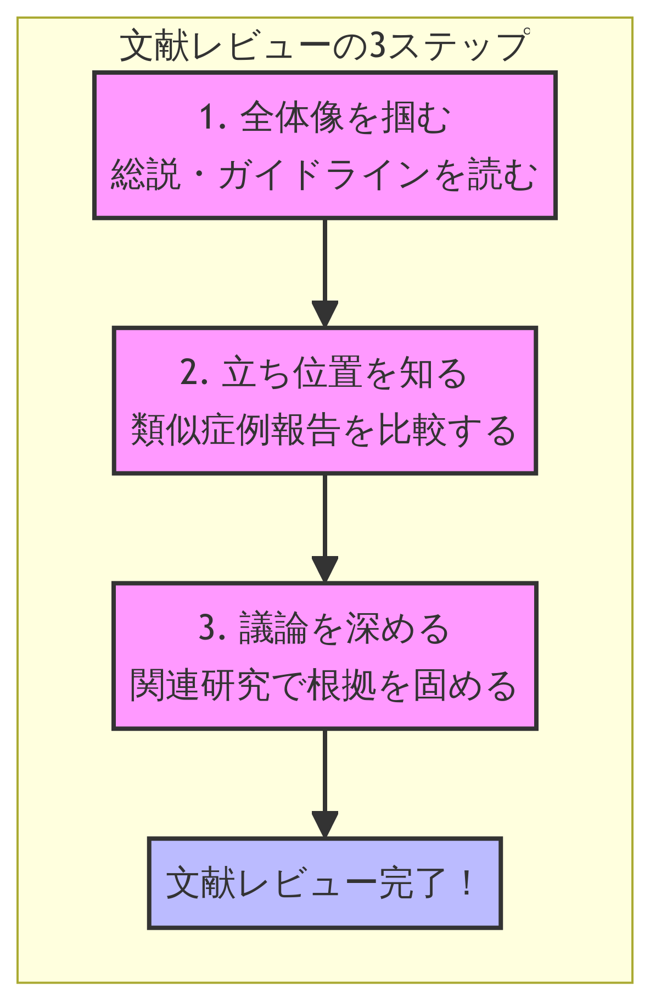

# Step 4: 文献レビュー

### 📋 このステップの目的

Step 2で自験例の「新規性」の仮説を立てた後、このステップではその仮説を証明し、論文の議論に深みを与えるための本格的な文献レビューを行います。
関連する文献を網羅的に収集・精読し、自験例を医学の大きな文脈の中に正確に位置づけることが目的です。
質の高い文献レビューは、論文のIntroduction（緒言）とDiscussion（考察）の根幹を成し、査読者を納得させるための最も重要な要素となります。

### ⏱️ 所要時間

8〜15時間

### 🎯 達成基準

- 関連する総説、ガイドライン、類似症例報告が網羅的に収集・整理されている。
- 主要な論文（キーペーパー）の要約が作成されている。
- 類似症例報告の比較表（患者背景、治療、転帰など）が完成している。
- 自験例が埋めるべき「知識のギャップ（Knowledge Gap）」が明確に言語化されている。

### 📝 詳細手順



効率的なレビューのため、以下の3ステップで文献を収集します。

#### 手順1: 文献の階層的収集


1.  総説論文 (Review Articles) & ガイドライン: まず、疾患の全体像、標準的な診断・治療法を理解するため、直近5年以内の質の高い総説論文や主要学会のガイドラインを2〜3本読み込みます。
これらはPerplexityやConsensusで効率的に見つけられます。
2.  類似症例報告 (Similar Case Reports): Step 2で収集した類似症例報告を5〜15本程度、精読します。
3.  関連研究 (Related Studies): 疾患のメカニズムや治療法の根拠となる基礎研究や臨床試験の論文も必要に応じて収集します。

#### 手順2: 論文の精読と要約

収集した論文を1本ずつ丁寧に読み込みます。
PDFをAIツールにアップロードし、要約プロンプトを使って効率化しましょう。
特に以下の点に注目します。

- 論文のPICO: どのような患者を、どのように治療し、どうなったか。
- 結論 (Conclusion): 著者の最も重要な主張は何か。
- 限界 (Limitations): その研究の弱点は何か。

#### 手順3: 類似症例の比較分析 (データ抽出)

文献レビューの核心となる作業です。
NotebookLMを使い、収集した類似症例報告のPDF（5〜15本）をすべてアップロードします。
プロンプトを使って、各症例から必要な情報を抽出し、比較表を自動生成させます。
この表が、後のDiscussion執筆における強力な武器となります。

#### 手順4: 知識のギャップの特定

作成した比較表と総説論文の内容を突き合わせ、「まだ誰も報告していないこと」「これまでの常識と異なる点」「未解決の問題点」などを明らかにします。
これが、あなたの症例報告が医学界に貢献できる「知識のギャップ」です。

### 🤖 推奨AIツール

このステップは、AIツールの連携が最も効果を発揮する場面です。

| ツール | 用途 | 優先度 |
|---|---|---|
| NotebookLM | 複数論文の一括分析、比較表の自動生成、知識のギャップ特定 | ⭐⭐⭐⭐⭐ |
| Perplexity (Pro) | 最新の総説・ガイドラインの検索、Deep Researchによる深掘り調査 | ⭐⭐⭐⭐ |
| ChatGPT (GPT-4) | 論文の要約、批判的吟味、文章の生成 | ⭐⭐⭐⭐ |
| Consensus | 特定の臨床疑問に対するエビデンスレベルの高い研究の検索 | ⭐⭐⭐⭐ |
| Research Rabbit | キーペーパーを起点とした関連論文の網羅的収集 | ⭐⭐⭐ |

*各ツールの詳細な使い方は付録C「推奨ツール一覧」と`/home/ubuntu/medicalprompthub/ai_literature_tools_guide.md`を参照*

### 💡 プロンプト集

#### プロンプト1: 1本の論文を構造的に要約・批判的吟味する (ChatGPT)

```
# 指示
あなたは臨床疫学の専門家です。アップロードされた論文を読み、以下の項目に従って構造的に要約し、批判的吟味を行ってください。

# 要約項目
1.  研究の背景と目的 (Background & Objective)
2.  研究デザイン (Study Design): (例: 症例報告, コホート研究)
3.  対象 (Population/Case): 
4.  主要な結果 (Key Results): 
5.  著者の結論 (Author's Conclusion): 

# 批判的吟味
1.  研究の長所 (Strengths): この研究の評価できる点は何ですか？
2.  研究の限界 (Limitations): この研究の解釈において注意すべき点は何ですか？
3.  臨床的意義 (Clinical Implication): この結果は、私たちの臨床実践にどのような影響を与えますか？
```

活用例: 1本1本の論文を深く理解し、自分の研究との関係性を考える上で非常に有効です。

#### プロンプト2: 複数症例報告の比較表を作成する (NotebookLM)

```
# 指示
ソースに含まれる全ての症例報告論文から、以下の項目を抽出し、マークダウン形式の表を作成してください。情報が見つからない場合は「記載なし」と記入してください。

# 抽出項目
- 著者, 年
- 国
- 症例数
- 年齢中央値
- 性別
- 基礎疾患
- 治療内容
- 治療反応
- 転帰
- 論文の結論
```

活用例: このプロンプト一つで、手作業なら数時間かかるデータ抽出と比較表の作成を、わずか数分で完了できます。
本ガイドで最も強力なプロンプトの一つです。

### 📚 実践例

症例: ステロイド抵抗性OP

1.  文献収集: Perplexityで「organizing pneumonia treatment guideline」を検索し、ATS/ERSのガイドラインを入手。
Research Rabbitでキーペーパーから展開し、類似症例報告を12本収集。
2.  精読と要約: ChatGPTのプロンプト1を使い、12本の論文を1本ずつ要約・吟味。
3.  比較分析: 12本のPDFをNotebookLMにアップロード。
プロンプト2を実行し、比較表を生成。
4.  知識のギャップの特定: 生成された表から、ほとんどの既報告例が「高用量ステロイド」に抵抗性を示しているのに対し、自験例は「中等量」で早期に抵抗性を示した点がユニークであると特定。
シクロホスファミドの使用例が極めて少ないことを再確認。

### ⚠️ よくある失敗と対処法

- 失敗: 論文をダウンロードするだけで満足し、精読しない（積読）。
  - 対処法: AIの要約機能を活用し、まずは概要を掴むことから始めましょう。
「1日1本要約を読む」など、小さな目標を立てることが継続のコツです。

- 失敗: 自分の主張に都合の良い文献ばかり集めてしまう（確証バイアス）。
  - 対処法: 自験例と矛盾する結果や、異なる見解の論文も意図的に探し、読むことが重要です。
scite.aiなどのツールで、ある論文を批判している「Contrasting（対立）」論文を探すのも有効です。

### 💪 上級者向けTIPS

文献レビューは一度きりで終わりではありません。
論文執筆中や査読過程で、新たな文献を追加する必要が出てきます。
ZoteroやPaperpileといった文献管理ツールを使い、収集した文献情報（PDF、要約、メモ）を一元管理しましょう。
タグ付け機能（例: #review, #casereport, #mustread）を活用すると、後の検索性が格段に向上します。

### ✅ チェックリスト

- [ ] 最新の総説論文・ガイドラインを読んだか？
- [ ] 類似症例報告を5本以上精読したか？
- [ ] NotebookLMなどを用いて、類似症例の比較表を作成したか？
- [ ] 自験例の「新規性」または「臨床的意義」を、文献に基づいて説明できるか？

### 🔗 関連リソース

- NotebookLM: [https://notebooklm.google/](https://notebooklm.google/)
- AI Literature Tools Guide: `/home/ubuntu/medicalprompthub/ai_literature_tools_guide.md`
- Literature Review Prompts: `/home/ubuntu/medicalprompthub/literature_review_prompts.md`

