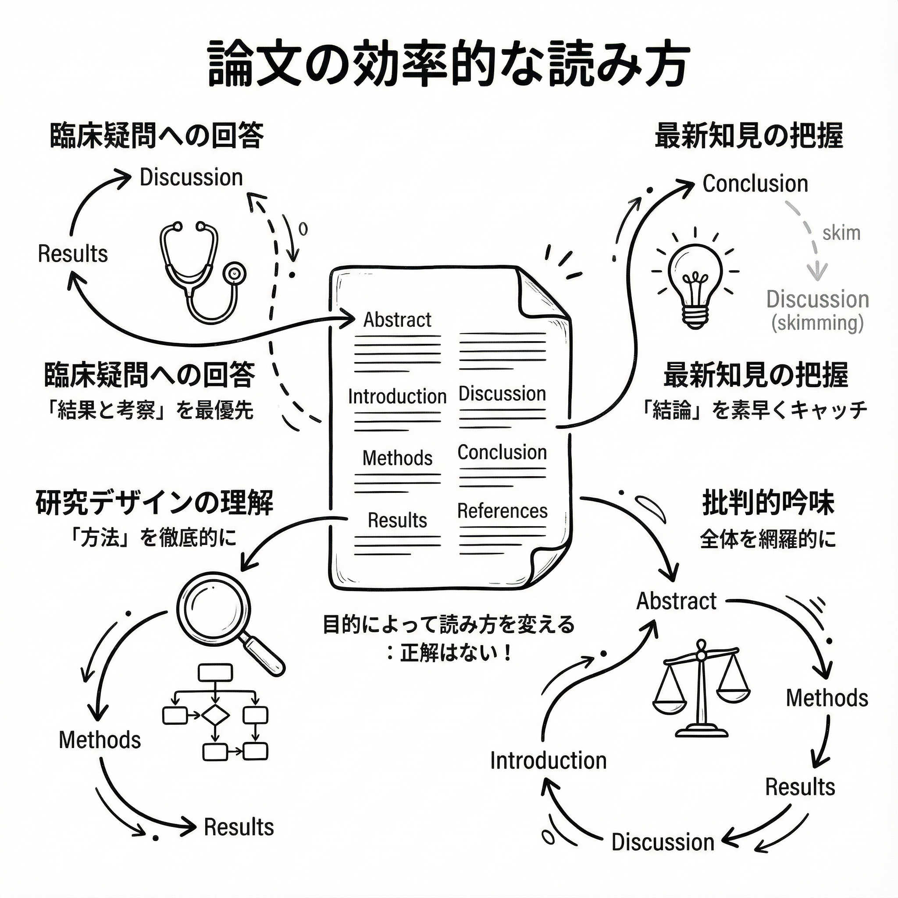

# Step 2: 論文は「つまみ食い」でOK！〜目的別の効率的な読み方〜

### 📋 このステップの目的

医学論文には、お作法とも言える標準的な構造（IMRAD）があります。
しかし、それを律儀に最初から最後まで読む必要は全くありません。
目的に応じて「つまみ食い」するのが、賢い読み方です。
このステップでは、論文の構造をサクッと理解し、あなたの目的に合わせた最短ルートの読み方をマスターします。

### ⏱️ 所要時間

10〜15分

### 🎯 達成基準

- 論文の各セクション（Abstract, Introduction, Methods, Results, Discussion）の役割を、自分の言葉で説明できる。
- 自分の目的に合った「読む順番」の最適ルートを選べる。
- 各セクションで、どこに注目すれば良いか（＝「つまみ食い」のポイント）を理解している。

### 📝 詳細手順



#### 手順1: 論文の「間取り」を知る

医学論文は、だいたいこんな「間取り」になっています。

| セクション | 役割 | 読むべきタイミング |
|---|---|---|
| Abstract | 全体の要約 | まずはここから！ |
| Introduction | 研究の背景・目的 | なぜこの研究が？を知りたければ |
| Methods | 研究のやり方 | 結果の信頼性を疑うなら、重点的に |
| Results | 研究の結果 | 最重要！ 研究の核心 |
| Discussion | 結果の解釈・意義 | 最重要！ 臨床にどう活かすか |
| Conclusion | 結論 | Abstractとセットで |

#### 手順2: あなただけの「読み方ルート」を見つけよう

「最初から最後まで」は、もう卒業。
あなたの目的に合わせて、4つのルートを使い分けましょう。


##### ルート1: 臨床での疑問に答えたい（最短ルート）

読む順番: `Abstract → Results → Discussion`

理由: 答えはだいたい「結果」と「考察」に書いてあります。
Methodsは、その結果が信じられるか気になった時だけでOK。

##### ルート2: 研究デザインを学びたい

読む順番: `Abstract → Methods → Results`

理由: 「どうやったのか」が知りたいので、Methodsを徹底的に。
ランダム化、バイアス対策、統計手法など、プロの手口を盗みましょう。

##### ルート3: 最新情報をサクッと把握したい

読む順番: `Abstract → Conclusion → Discussion（つまみ食い）`

理由: とにかく時間がない！
そんな時は、結論とその意義だけをキャッチ。
詳細は後で気になったら読めばいい。

##### ルート4: 抄読会で発表する（全部読むルート）

読む順番: `Abstract → Methods → Results → Discussion → Introduction`

理由: 批判的吟味には、全てを読む必要があります。
研究の信頼性、結果の妥当性など、隅々までチェックします。

### 🤖 AIという「ナビゲーター」

| ツール | 用途 | 優先度 |
|---|---|---|
| ChatGPT | 読む順番の提案、構造の解説 | ⭐⭐⭐ |
| Claude | 読む順番の提案、構造の解説 | ⭐⭐⭐ |

### 💡 AIへの「話し方」

#### プロンプト1: 「この論文、どう読めばいい？」

```
# 指示
この論文のAbstractを読んで、僕の目的に合った「読む順番」と「各セクションでの注目ポイント」を教えて。

# 論文のAbstract
[Abstractの内容を貼り付け]

# 僕の目的
[臨床での疑問解決/研究デザインの勉強/最新情報のキャッチアップ/抄読会の準備]
```

### ⚠️ よくある「落とし穴」

- 失敗:律儀に最初から読んで、途中で力尽きる。
  - 対処法: 「つまみ食い」こそ正義！
目的地の「結果」と「考察」に直行しましょう。

- 失敗: Methodsの沼にハマって、時間を溶かす。
  - 対処法: Methodsは後回し。
まずは結論を知ってから、気になったら戻るのが効率的。

### 💪 上級者への道

- 図表を先に眺める: Resultsの文章を読む前に、FigureとTableをざっと見るだけで、結果の全体像が掴めます。
- Introductionは最後に: 全てを理解してから背景を読むと、「なるほど、だからこの研究が必要だったのか」と、より深く納得できます。
- Discussionの「限界」に注目: 著者が自ら認める研究の弱点（Limitations）は、結果を鵜呑みにしないための重要なヒントです。

### ✅ チェックリスト

- [ ] 論文の「間取り」を理解したか？
- [ ] 自分の目的に合った「読み方ルート」を選んだか？
- [ ] 各セクションでの「つまみ食い」のポイントを把握したか？

### 🔗 次のステップ

論文の歩き方がわかったら、いよいよAIの力を最大限に引き出します。
[Step 3: AIツールを使った要約と分析](../03-analysis/step-03.md)に進みましょう。

